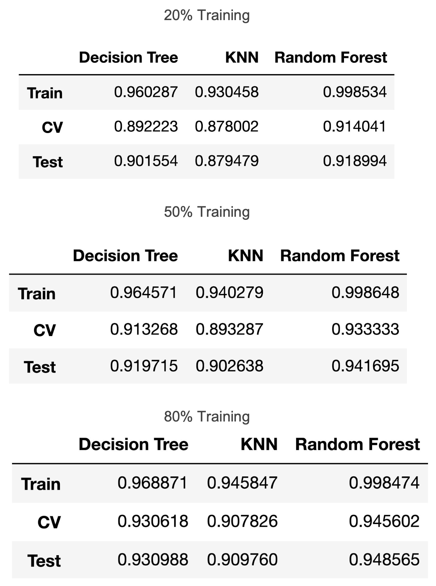
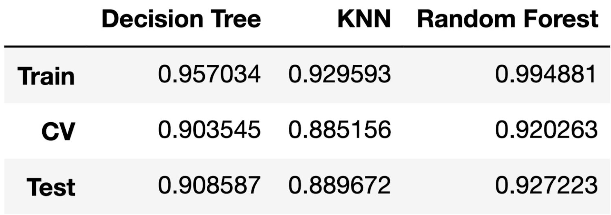

# An Empirical Comparison of Supervised Learning Algorithms
Replication of ​Caruana and NiculescuMizil Paper 

# Abstract
This project combined my knowledge of statistics, data science, and computer science to give me insight as to how different machine learning algorithms perform from an empirical standpoint.

# Introduction
In my analysis, I chose three types of classifiers in order to make the ranking process clear. Since all 3 classifiers can be compared using accuracy of the classifier, it is easy to digest the results of my study. Going into this project, I had the​ ​Caruana and NiculescuMizil research paper to provide me with expectations going in. The three algorithms that I tested were Decision Tree Classifier, K Nearest Neighbors Classifier, and Random Forest Classifier. Of the three, Decision Tree and Random Forest should outperform K Nearest Neighbors by a significant margin, but Decision Tree and Random Forest should be relatively close in performance. With that knowledge, I went ahead and conducted my analysis.
    
As for datasets used to train and test the classifiers, I chose 3 from the UCI dataset repository. The first one dealt with predicting car acceptability using only categorical variables for price, condition, comfort, etc... The second one dealt with chess set ups, it used the location of certain chess pieces on the board to predict which player would win. It consisted entirely of binary attributes for the locations of the different chess pieces. The last dataset used a motion sensor attached to a person’s hip to determine what type of movement they were doing (walking, running, sitting...). This dataset only had numerical columns.

# Method
I used three datasets from the UCI repository to test the classifiers, and had to modify some of them. Since this classifiers only deal with numerical data, and real world data can be categorical or ordinal, I used One-Hot-Encoding to feed the data to the algorithms in a way that they could understand. Some of the datasets also had inconsistent delimiters for separating data points. To fix this I used basic regular expressions after some visual analysis of data to see what exactly was inside of each dataset. Once the datasets were properly prepared, I could pass the data into the classifiers. However, before I train and test the classifiers, I have to tune the hyper parameters. The most common way to tune hyper-parameters is to use a grid search cross validation with all possible combinations of the different parameter lists that I choose. For the Random Forest Classifier, I tested n_estimators = (10, 50, 100), max_depth = (5, 10, 20, None), and criterion = (“gini”, “entropy”). For K Nearest Neighbors Classifier, the parameter I chose to optimize was n_neighbors = (2, 3, 4, 5, 6). For the Decision Tree Classifier, the parameters I tuned were max_depth = (5, 10, 20, None), and criterion = (“gini”, “entropy”). Now the only thing left to do was to test out these newly tuned classifiers. I will note that I did not attempt to tune all of the hyper parameters due to my lack of mastery of each algorithm in combination with the computational price of a very large grid search cross validation on decently large datasets. This means that the classifiers will not be perfectly tuned and the accuracy could always be better. However, I feel that the hyper parameters that I chose are all very impactful and the result will still be meaningful.

As for what to do with the results, since each learning algorithm is a classifier, all I have to do is compare accuracy. If the accuracy of one classifier is significantly better than another classifier’s accuracy on the same data, it is safe to assume that the classifier with the higher accuracy is better. Of course this is only if the results are consistent across datasets, which is why I am using three different datasets to test the classifiers on. The convenient part about comparing only classifiers is that I do not have to transform the results of each learning algorithm in order to compare them. Once I get the results, I can easily compare them and select which classifier or classifiers perform the best.

# Experiment
For the actual experiment, I first selected and prepared the datasets, using pandas and regular expressions. The shape of the datasets were (1728, 7), (3196, 36), (10297, 562) respectively. The feature number grew for the first two since they required One Hot Encoding, but the difference is negligible. Each of the classifiers were tested on 3 splits; 20% training and 80% testing, 50% training and 50% testing, 80% training and 20% testing. For each trial of each split of the data, I tuned the hyper parameters using a grid search cross validation from sci-kit learn. As for the classifiers themselves, I used the sci-kit learn implementations for each classifier. I then fit the classifiers to the training data and tested their performance using a cross validation score and using withheld testing data. Each split was tested 3 times and the accuracies were collected, then the result was averaged. I used 3 accuracies to compare each classifier; training accuracy, cross validation accuracy, and testing accuracy.
I compared the classifiers in two ways. The first way was to compare the average accuracy for each classifier across the different splits of data. So I computed average accuracy for a 20% training 80% testing split across the 3 datasets for each classifier. I did the same for 50% training 50% testing split and 80% training 20% testing split. The purpose of this was to simulate different real world cases, sometimes you do not have the desired amount of data but still have to make predictions, so knowing which classifier could predict the best based off of little training is useful. Here there will be 27 total accuracies. The training, cross validation, and testing accuracy for each classifier for each split of the data.

The second comparison was just a total average accuracy across all splits and all datasets for each classifier. Here there will only be 9 accuracies; the training accuracy, cross validation accuracy, and testing accuracy for each of the 3 classifiers. This answers the question of: With as much information as possible, which classifier will perform the best?

# Conclusion
Here are the results from each training split:

Here are the results that were averaged from all splits of all datasets:

In conclusion, the Random Forest outperformed K Nearest Neighbors and Decision Tree across every accuracy metric, and across every training split. As for the different training splits, all data pointed towards more training data leads to better testing results. Some data sets were relatively easy to classify, so the difference is not as great for the bigger splits. If the splits were 10%, 50%, 90%, we would see a bigger difference in performance among the classifiers. Random Forest also outperformed the other algorithms when comparing total averages, avoiding Simpson’s paradox. Decision Tree was a universal second place, and KNN performed the worst in every case, although not by much. However, the consistency of these results leads me to rank the classifiers as follows:

    1st: Random Forest
    2nd: Decision Tree
    3rd: K Nearest Neighbors
    
These results are also consistent with the finding in the Caruana and NiculescuMizil research paper, further boosting my confidence in these results.

# References
Caruana and NiculescuMizil, An Empirical Comparison of Supervised Learning Algorithms,
https://www.cs.cornell.edu/~caruana/ctp/ct.papers/caruana.icml06.pdf
Packages Sci-kit learn, https://scikit-learn.org/stable/
Numpy, https://www.numpy.org/
Pandas, https://pandas.pydata.org/pandas-docs/stable/ Regular Expressions, ​https://docs.python.org/2/library/re.html
Data UCI Dataset Repository, https://archive.ics.uci.edu/ml/datasets/human+activity+recognition+using+smartphones
